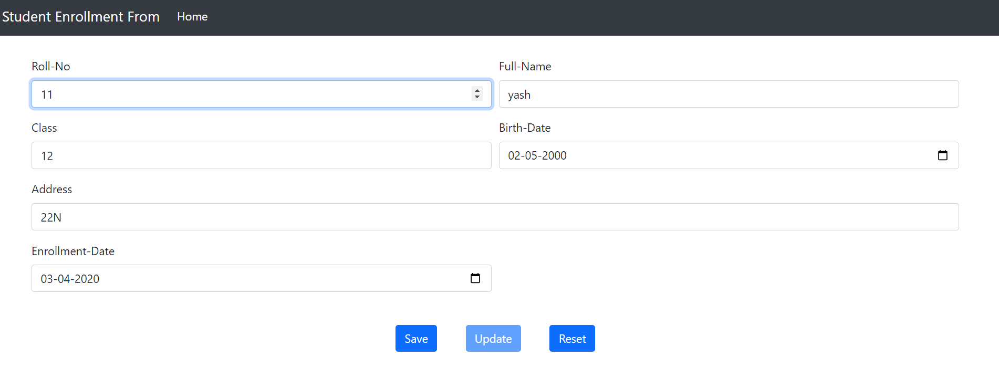
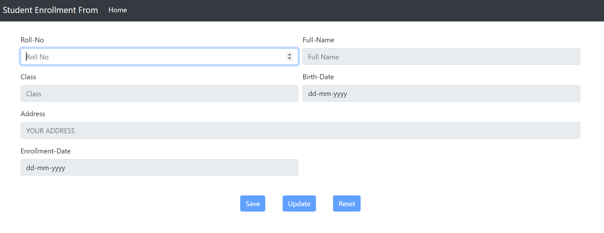
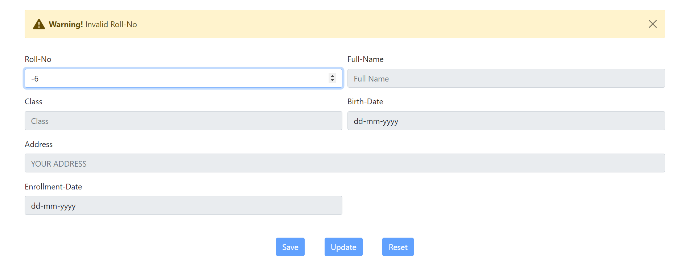
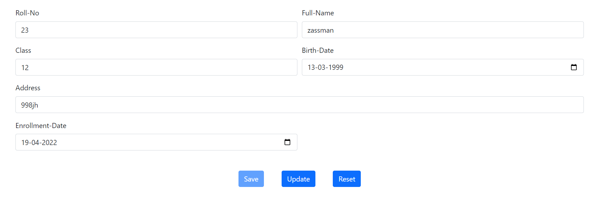
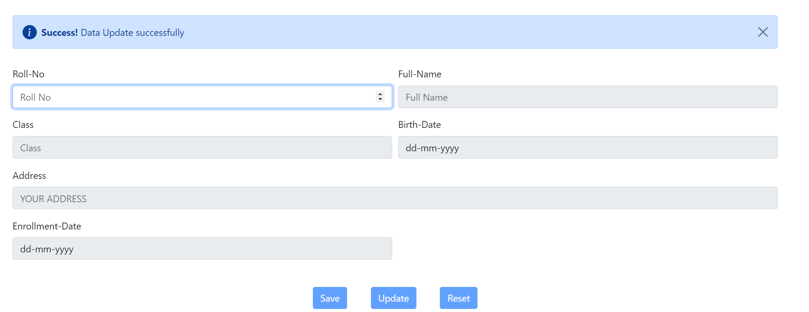
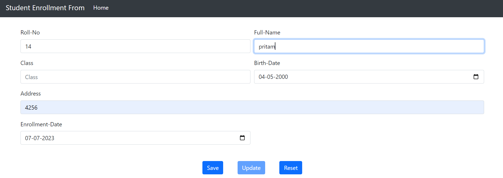
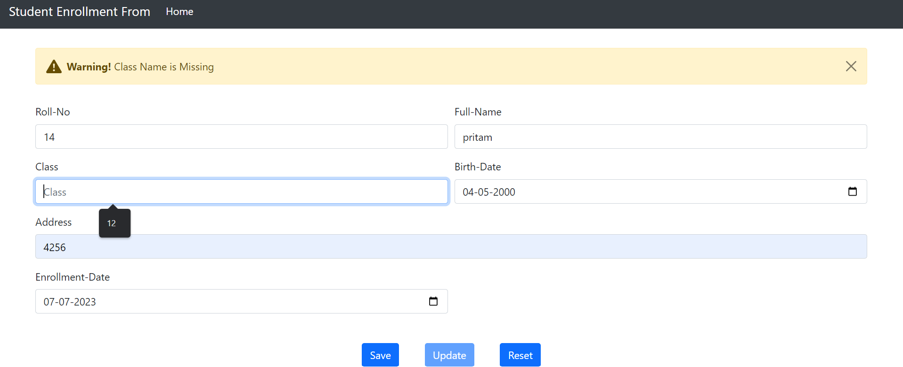

# Student-Enrollment-Form
## Description 
A lucid Student entry form aimed at implementing basic crud through JsonPowerDb

# Benefits of using JsonPowerDB
* Simple to learn
* Support different types of Databases.
* Backends code is not required for database 
* Schema-less 
* Easy for developers to code in

# TECH STACK USED
* HTML
* CSS
* JAVASCRIPT 
* JsonPowerDB ( As Database)

# Screenshots:

# Illustrations:
* **UPDATE** : when student roll number is already present in database then student information is fetched from database and filled in respective feild then user can UPDATE student information 
* **SAVE** : If student roll number is not existed in database then we can fill other field and save in database
* **clear** : By this we can clear all field of form and with this except first field (roll-no) other field are disabled until user enter any roll number
* **Alert** : This website uses disposable Alter prompt using bootstrap

# HOW TO USE

* **Initially**

We need to enter a roll number 

If roll number is not valid 

If roll number is valid and that roll number is existnig in database

* **Fetching student data using roll number**
  If student already present in database, then all field filled with that student information
  
  
  otherwise, other fields are enabled after user input roll number
  
* **Updation of student details**
  In order to update student details input roll number, and then we can update the student data
  
  
  
  

* **Adding new student data**

  Enter new roll number and then all other fields are enabled and then after filling student information we can save this data into database only if input is valid
  
  
  
  
  
 * **If input data is not valid**
 
   
  
   

    
  
  